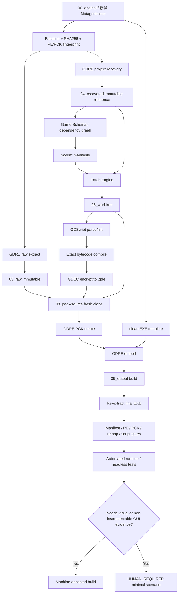
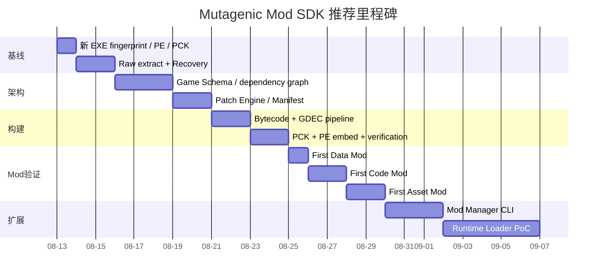

# Mutagenic（Godot 3.5.3 custom_build）Mod 工程可行性、工具链与自动化实施研究

## Executive Summary

**结论：从工程角度看，为 Mutagenic 建立一个可持续维护的 Mod 开发体系是高度可行的。** 更准确地说，这个项目不应继续定义为“汉化工程”，而应定义为：

> **Mutagenic Recovery & Mod SDK：从原版 EXE 确定性恢复游戏资源和脚本，在不可变原版之上应用 Data / Code / Asset Mod，再以原游戏可接受的 GDScript bytecode、`.gde` 加密方式和 Godot 3.x PCK/PE 嵌入形式重新构建。**

上一轮实际工程已经证明几个决定性事实：Mutagenic 是 Windows x64 Godot 游戏；原 EXE 中存在名为 `pck` 的 PE section；曾成功恢复约 **3744 个 PCK 文件**和约 **524 个 `.gde` 脚本**；运行时识别为 `Godot Engine v3.5.3.custom_build`；恢复工程中已经出现 `Globals/Skills.gd`、`Globals/Genes.gd`、`Globals/MonsterStats/MonsterStats.gd`、`Scenes/Skills/GenericSkill.gd` 等核心游戏逻辑。与此同时，上一轮也暴露了必须在新工程中消灭的失败模式：误翻译代码标识符、编译结果扁平化导致同名脚本覆盖、最终 PCK overlay 漏文件，以及修改 PCK 后没有正确维护 embedded-PCK/PE 结构。fileciteturn0file0

公开工具链已经足以支撑这一目标。**GDRE Tools / gdsdecomp** 当前能够直接处理 embedded EXE/PCK、恢复 Godot 2/3/4 项目、反编译/编译 GDScript、检测和指定 bytecode revision、创建/patch PCK，并提供 `--embed` 重新嵌入 EXE；**GdTool** 可以作为独立 bytecode detector/编译反编译交叉验证器；**GodotPckTool / GodotPCKExplorer** 可作为 PCK 独立验证器；**Godot-GDEC** 则给出了 Godot 3.x `GDEC` 加密文件格式及 AES-256 加解密参考。citeturn24view0turn21search4turn17search9turn21search1turn23search1

一个重要的技术纠正是：**Godot 3.5.3 的 PCK header 不能按早期尝试中的 `uint16` 方式解释。** Godot 3.5.3 官方源码实际按 `uint32` 依次读取 `version / major / minor / patch`，随后跳过 16 个保留 `uint32`，再读取 `file_count`；每个条目则是 path length、path、64-bit offset、64-bit size 和 16-byte MD5。官方 loader 还明确先寻找 Windows 可执行文件的 `pck` section，最多处理 8 字节对齐差异，再退回文件尾 embedded-PCK trailer 的检测方式。citeturn18view0

因此，这次**不要再自己猜 PCK/PE 格式并手工拼 EXE**。默认生产路径应该是：

```text
原始 EXE
   ↓
Baseline/Fingerprint
   ↓
GDRE 原始提取 ───────────────→ 03_raw（不可变）
   ↓
GDRE Recovery
   ↓
04_recovered（可读参考，不直接打包）
   ↓
Game Schema
   ↓
mods/*
   ↓
Patch Engine
   ↓
06_worktree
   ↓
GDScript compile
   ↓
.gdc → GDEC/.gde
   ↓
覆盖回 03_raw 的镜像
   ↓
08_pack/source
   ↓
GDRE --pck-create / --embed
   ↓
最终 EXE
   ↓
重新解包 + PE/PCK + hash + script + runtime gates
```

第一阶段建议坚持 **compile-time Mod**，即构建时合并 Mods；不要一开始实现复杂 runtime loader。等 deterministic build 稳定以后，再评估将 **Godot Mod Loader 3.x v6.3.0** 引入恢复工程，使游戏支持 ZIP Mods、依赖、加载顺序、配置、Profiles、Steam Workshop/Thunderstore/local `/mods` 等能力。该项目明确维护 Godot 3.x 分支，因此是 Mutagenic 后期“非官方 Mod Framework”的首选公开基础，但它对这个加密 custom build 是否能直接 bootstrap 属于**需在本机验证**，不能现在假设可直接安装。citeturn22search1

同时，人工作为测试环节应降到最低：DeepSeek V4 Flash 不需要看图、也不需要操作 GUI 才能完成绝大部分工程验证。可以通过**恢复项目的 headless smoke-test、资源加载测试、manifest/hash 比对、脚本重新解密/反编译、最终 EXE 再解包、运行日志 diff、进程 exit code 和测试构建 instrumentation**自动覆盖大部分问题。只有布局、动画观感、真正依赖玩家输入路径且无法 instrumentation 的行为，才进入 `HUMAN_REQUIRED`。

本报告按你的最新要求，**不讨论 EULA、法律、反作弊和 Mod 分发法律风险，也不做跨游戏版本兼容性设计**。本文中的“版本检查”只服务于工程上的**精确版本识别、工具固定、构建可重复性和 fail-fast**。

## 技术基线与本机验证

上一轮数据只能作为**候选基线**；由于你准备重新下载 EXE，新项目必须重新测量，不能继承旧结果。尤其是 AES key、bytecode revision、PCK manifest 都只能在新 EXE 验证后才能进入 `baseline.json`。上一轮 OpenCode 会话中确认的环境和结果应作为 regression knowledge，而不是构建输入。fileciteturn0file0

建议建立以下技术基线：

| 项目 | 上一轮已知 | 新工程要求 |
|---|---|---|
| OS/格式 | Windows x64 PE32+ | **需本机验证** |
| Engine | `3.5.3.custom_build` | **需本机验证** |
| PCK | EXE 内 PE `pck` section | **需本机验证** |
| PCK format | Godot 3.x | 自动解析，禁止猜 |
| PCK 文件数 | 约 3744 | **需本机验证** |
| Scripts | 约 524 `.gde` | **需本机验证** |
| Script encryption | Godot `GDEC` / 32-byte key | **需本机验证** |
| AES key | 上一轮存在已恢复候选 key | 只作为 candidate，不硬编码 |
| Bytecode | Godot 3.5.x 对应 revision | 必须 GDRE + 第二工具验证 |
| Project settings | `project.binary` | 必须最终构建可重新解析 |
| Remap | `.gd.remap → .gde` 等 | 必须保持 target 存在 |
| Imported assets | Godot 3 `res://.import` | **需本机验证** |

Godot 3.5.3 官方 `file_access_pack.cpp` 对这里尤其重要：PCK 可以作为独立包从 offset 0 读取，也可以在可执行文件的 `pck` section 中定位；section offset 与 PCK 起点允许最多约 8 字节对齐搜索；如果 section 定位失败，loader 还会检查文件末尾 `GDPC` 并利用尾部保存的 64-bit size 回推 PCK 起点。PCK 索引中的文件条目包含相对资源路径、64-bit offset/size 和 MD5。citeturn18view0

**新项目第一次进入目录后，应先执行：**

```powershell
$ErrorActionPreference = "Stop"

Get-Location
$PSVersionTable
python --version
git --version

$exe = ".\00_original\Mutagenic.exe"

Get-Item $exe |
    Select-Object FullName, Length, LastWriteTimeUtc

Get-FileHash $exe -Algorithm SHA256

# 尝试让 Godot runtime 自报版本。
# 若该 custom build 不响应 --version，不应据此失败，后面让 GDRE / binary scan 接管。
& $exe --version 2>&1 |
    Tee-Object ".\01_baseline\exe_version.txt"
```

上一轮环境是 PowerShell，而 Bash 风格：

```bash
python - <<'EOF'
...
EOF
```

曾被错误地交给 PowerShell 执行而失败。因此新项目里所有超过几行的 Python 都应保存成独立 `.py` 文件，不要让 AI 构造 PowerShell/Bash/Python 三层 quoting。fileciteturn0file0

例如建立：

```text
scripts/
  inspect_pe.py
  inspect_pck.py
  fingerprint_game.py
```

`inspect_pe.py` 可以使用 `pefile`：

```python
from __future__ import annotations

import hashlib
import json
import pathlib
import sys

import pefile


def sha256(path: pathlib.Path) -> str:
    h = hashlib.sha256()
    with path.open("rb") as f:
        for chunk in iter(lambda: f.read(1024 * 1024), b""):
            h.update(chunk)
    return h.hexdigest()


def main() -> int:
    if len(sys.argv) != 2:
        print("usage: inspect_pe.py <exe>", file=sys.stderr)
        return 2

    path = pathlib.Path(sys.argv[1]).resolve()
    pe = pefile.PE(str(path), fast_load=False)

    sections = []
    for section in pe.sections:
        name = section.Name.rstrip(b"\x00").decode("ascii", "replace")
        sections.append(
            {
                "name": name,
                "raw_offset": section.PointerToRawData,
                "raw_size": section.SizeOfRawData,
                "virtual_address": section.VirtualAddress,
                "virtual_size": section.Misc_VirtualSize,
            }
        )

    result = {
        "file": str(path),
        "size": path.stat().st_size,
        "sha256": sha256(path),
        "machine": pe.FILE_HEADER.Machine,
        "sections": sections,
    }

    print(json.dumps(result, indent=2))
    return 0


if __name__ == "__main__":
    raise SystemExit(main())
```

`pefile` 能读取 PE headers、sections 和 embedded data，也允许基本字段修改，但其项目明确指出它不会为了新字段自动重排 PE，因此我建议把它用作**验证器而不是生产 PCK embed writer**。真正需要复杂 PE 修改时，LIEF 能解析和修改 PE/ELF/Mach-O，包括添加 section，适合作为手工 fallback。citeturn23search2turn23search4

安装：

```powershell
python -m pip install pefile lief

python .\scripts\inspect_pe.py `
    .\00_original\Mutagenic.exe `
    > .\01_baseline\pe.json
```

然后用 GDRE 建立第二层基线：

```powershell
$gdre = ".\02_tools\gdre\gdre_tools.exe"
$exe  = ".\00_original\Mutagenic.exe"

& $gdre --headless --gdre-version
& $gdre --headless --godot-version

& $gdre --headless --list-files="$exe" `
    > ".\01_baseline\pck_files.txt"

& $gdre --headless --list-bytecode-versions `
    > ".\01_baseline\gdre_bytecodes.txt"
```

GDRE 当前 CLI 正式提供 `--recover`、`--extract`、`--list-files`、`--compile`、`--decompile`、`--pck-create`、`--pck-patch`、`--list-bytecode-versions`、`--dump-bytecode-versions`、资源 binary/text 转换，以及 custom bytecode definition；其 README 明确建议使用与原游戏相同的 Godot 工具版本来编辑恢复项目，并指出 recovery log 会给出检测到的版本。citeturn24view0turn24view1

**PCK parser 的本地验证器不要再按 uint16 写。** Godot 3.5.3 源码对应的简化 parser 应类似：

```python
magic = read_u32()
assert magic == 0x43504447  # "GDPC" in LE representation

pack_version = read_u32()
engine_major = read_u32()
engine_minor = read_u32()
engine_patch = read_u32()

reserved = [read_u32() for _ in range(16)]

file_count = read_u32()

for _ in range(file_count):
    path_len = read_u32()
    path = read_bytes(path_len).decode("utf-8")
    offset = read_u64()
    size = read_u64()
    md5 = read_bytes(16)
```

这与 Godot 3.5.3 官方 loader 的实际读取顺序一致，也是上一轮“PCK header 看起来怪异”的根本纠正。citeturn18view0

`.gde` 则是另一层。Godot 3.x 的 encrypted file 格式以 `GDEC` 为魔数，公开的 Godot-GDEC PoC 对 3.6 及以下版本描述了：mode、明文 MD5、64-bit data length 和 AES-256 ECB 加密数据；不足 16-byte block 的尾部以零补齐，解密后应重新校验 MD5。这个项目适合作为独立格式参考和验证器。citeturn23search1

因此新 EXE 的旧 AES key 应这样处理，而不是直接相信：

```text
OLD_KEY
   ↓
candidate only
   ↓
随机选 5～20 个原始 .gde
   ↓
GDEC decrypt
   ↓
MD5 check
   ↓
GDRE/GdTool decompile
   ↓
所有样本都成功？
   ├─ YES → VERIFIED_KEY
   └─ NO  → KEY_REJECTED，重新定位 key
```

最终 `baseline/game_fingerprint.json` 建议至少保存：

```json
{
  "exe_sha256": "...",
  "exe_size": 0,
  "engine_runtime_version": "3.5.3.custom_build",
  "pck_format": 1,
  "pck_file_count": 0,
  "pck_manifest_sha256": "...",
  "bytecode_revision": "...",
  "script_count_gde": 0,
  "script_key_fingerprint": "sha256:...",
  "pe_pck_section": {
    "raw_offset": 0,
    "raw_size": 0
  }
}
```

这里不要把 AES key 本体写进 Git manifest。建议：

```text
.secrets/
  script_key.txt
```

并加入：

```gitignore
.secrets/
```

然后：

```powershell
$env:MUTAGENIC_SCRIPT_KEY = `
    (Get-Content ".\.secrets\script_key.txt" -Raw).Trim()
```

这样 AI 仍能自动运行工具，但不会把 key 粘得到处都是。

## 可修改内容域与恢复路径映射

从上一轮恢复工程的实际文件名看，Mutagenic 的游戏系统相当一部分在 GDScript 和 Godot resources 层，而不是全部硬编码于 native EXE，因此它不仅适合汉化，也适合形成完整的平衡、技能、装备、敌人和资源 Mod 系统。下面的“已知路径”来自上一轮恢复会话；新 EXE 恢复完成后必须由 schema scanner 重新确认。fileciteturn0file0

| 内容域 | 已知或高概率入口 | 推荐 Mod 方式 | 新工程验证方式 |
|---|---|---|---|
| 技能注册/数值 | `Globals/Skills.gd` | Data Patch | AST/registry scan |
| Skill Support | `Globals/SkillSupports.gd` | Data/Code | 搜索 support IDs |
| 技能行为 | `Scenes/Skills/**`、`GenericSkill.gd` | Code Patch | 调用关系图 |
| 投射物 | `Scenes/Projectiles/Projectile.gd` 等 | Code/Data | preload/scene graph |
| 装备基础数据 | `Globals/Genes.gd` | Data | registry/schema |
| 装备 Mod/词缀 | `Globals/Genes/GeneMods.gd` | Data | key/value extraction |
| Unique 池 | `Globals/Genes/UniquePools/**` | Data/Additive | pool reference check |
| 属性定义 | `Globals/StatsInfo.gd` | Data | stat ID graph |
| Passive/tag stats | `Globals/PassiveTagStats.gd` | Data | ID uniqueness |
| 装备命名 | `Globals/ItemNameGenerator.gd` | Data | string/data only |
| 外观/Outfit | `Globals/Outfits.gd` | Data/Asset | texture references |
| 敌人数值 | `Globals/MonsterStats/MonsterStats.gd` | Data | monster ID map |
| 敌人能力 | `Scenes/**Monster**/**` 等待扫描 | Code/Scene | inheritance/call graph |
| Level/Zone | `Globals/Levels.gd` | Data | scene references |
| 地图 | 对应 `.tscn/.tres` | Scene/Data/Asset | ResourceLoader test |
| UI | `.tscn/.tres`、Theme、fonts | Scene/Asset | text/layout refs |
| 精灵 | PNG/`.stex`/SpriteFrames | Asset | import map |
| 动画 | SpriteFrames / Animation resources | Asset/Scene | animation name/track audit |
| 存档 | **未知** | Code/Data | 扫 `user://` 读写代码 |

**第一件真正的 Mod 开发工作不应该是改数值，而应该是生成 `game_schema.json`。**

建议让 AI 扫描：

```powershell
rg -n --glob "*.gd" `
  "Skills|SkillSupports|Genes|GeneMods|MonsterStats|PassiveTagStats|StatsInfo" `
  ".\04_recovered"

rg -n --glob "*.gd" `
  "preload\(|load\(|ResourceLoader|PackedScene|instance\(" `
  ".\04_recovered"

rg -n --glob "*.gd" `
  "user://|ConfigFile|store_var|get_var|JSON\.|ResourceSaver|ResourceLoader" `
  ".\04_recovered"
```

以及：

```powershell
Get-ChildItem ".\04_recovered" -Recurse -File |
    Group-Object Extension |
    Sort-Object Count -Descending |
    Select-Object Count, Name
```

然后输出：

```text
05_schema/
  game_schema.json
  registries/
    skills.json
    equipment.json
    affixes.json
    enemies.json
    stats.json
    levels.json
  graphs/
    script_dependencies.json
    scene_dependencies.json
    resource_dependencies.json
  saves/
    persistence_calls.json
```

例如最终 schema 可能长这样：

```json
{
  "skills": {
    "registry_files": [
      "res://Globals/Skills.gd"
    ],
    "runtime_bases": [
      "res://Scenes/Skills/GenericSkill.gd"
    ],
    "projectile_bases": [
      "res://Scenes/Projectiles/Projectile.gd"
    ]
  },
  "equipment": {
    "registry_files": [
      "res://Globals/Genes.gd"
    ],
    "modifier_files": [
      "res://Globals/Genes/GeneMods.gd"
    ]
  }
}
```

**这个示例只能作为 schema 格式，不可以硬编码为真实游戏事实。**

代码层 Mod 还必须注意 Godot `NodePath`。Godot 3.5 官方文档明确指出，`NodePath` 是场景树中的节点/资源/属性路径，并且普通字符串传给 `get_node()` 时会被自动解释为 NodePath；因此 `get_node("Equipment")`、Animation track path、节点重命名等都属于程序结构，不是显示文本。citeturn17search8

这正解释了上一轮为什么：

```gdscript
get_node("Equipment")
```

被改成：

```gdscript
get_node("装备")
```

会导致真正的 runtime failure。fileciteturn0file0

以后 Mod patch 应分为：

```text
data
  └─ 改注册表中的数值、flags、枚举组合、列表

code
  └─ 改函数、控制流、技能/AI 行为

asset
  └─ PNG、SpriteFrames、场景、声音、字体等

localization
  └─ UI/display-only 文字
```

而不是把四种修改全部变成“字符串搜索替换”。

一个更安全的技能 Patch 应写成：

```yaml
schema_version: 1

target: res://Globals/Skills.gd
expected_sha256: "..."

operation: set_value

selector:
  registry: Skills
  id: ChainLightning
  field: chain_count

value: 8
```

而不是：

```yaml
replace:
  old: "3"
  new: "8"
```

如果 `expected_sha256` 或 selector 找不到，就应该：

```text
PATCH_PRECONDITION_FAILED
```

直接停止该构建，禁止 fuzzy replace。

## 工具链、Mod 管理与版本维护

截至 2026 年 8 月的公开生态中，**GDRE Tools 是 Mutagenic 这类 Godot packaged-game 工程最应该作为主轴的工具**。它直接面向完整项目恢复，并且把 PCK、bytecode 和 binary/text resource 转换整合到一个 CLI；当前 README 明确仍支持 Godot 3.x/2.x 的恢复和反编译，不过该项目自身从源码构建的最新开发分支已经放弃 3.x build 支持，因此生产环境应固定一个已验证的 GDRE release binary，而不是每次跟 master 构建。citeturn21search0turn24view0

| 工具 | 用途 | Mutagenic 定位 | 典型命令 | 优势 | 注意点 |
|---|---|---|---|---|---|
| **GDRE Tools / gdsdecomp** | EXE/PCK recovery、GDScript、PCK create/patch | **主工具** | `gdre_tools --headless --recover=...` | 一站式；支持 embedded EXE 和 Godot 3 | 固定已验证 release |
| **GdTool** | bytecode detect / decode / build | 第二验证器 | `GdTool detect -i game.exe` | 与 GDRE 独立实现 | 项目较小 |
| **GodotPckTool** | PCK list/extract/create | PCK 第二验证器 | `godotpcktool game.pck -a e -o out` | 简单独立 | 不负责完整恢复 |
| **GodotPCKExplorer** | PCK GUI/CLI、embed/patch/split | 调试/人工检查 | `GodotPCKExplorer.Console.exe -h` | 支持 Godot 3/4 embedded PCK | 不替代脚本恢复 |
| **Godot-GDEC** | Godot 3 encrypted file 格式参考 | `.gde` 加密验证 | Go PoC | 格式透明 | PoC，不作为唯一生产工具 |
| **gdscript-toolkit 3.x** | parser/lint/format | Source gate | `gdlint file.gd` | 有 Godot 3 分支 | 先验证 recovered syntax |
| **pefile** | PE section inspection | 默认 PE validator | Python | 简单稳定 | 不适合复杂重排 |
| **LIEF** | PE 结构修改 | 手工 fallback | Python/C++ | 可修改/添加 section | 默认不应取代 GDRE embed |
| **Godot Mod Loader** | runtime mod loader | 第二阶段 | 集成 addon | ZIP mod、dependency/profile | 需先 bootstrap |
| **just** | 项目 command runner | 推荐总入口 | `just build` | Windows/跨平台、recipe dependency | 不取代 build scripts |
| **pre-commit** | 提交前 gates | 推荐 | `pre-commit run --all-files` | 多语言 hook | 固定 hook revision |
| **Renovate** | 工具/依赖更新检查 | 推荐维护工具 | repo bot/CLI | 自动产生更新 PR | 不允许自动升级生产 pins |

相关项目的公开页面：

```text
GDRE Tools
https://github.com/GDRETools/gdsdecomp

GdTool
https://github.com/lucasbaizer/GdTool

GodotPckTool
https://github.com/hhyyrylainen/GodotPckTool

GodotPCKExplorer
https://github.com/DmitriySalnikov/GodotPCKExplorer

Godot-GDEC
https://github.com/piman51277/Godot-GDEC

GDScript Toolkit
https://github.com/Scony/godot-gdscript-toolkit

Godot Mod Loader
https://github.com/GodotModding/godot-mod-loader

pefile
https://github.com/erocarrera/pefile

LIEF
https://github.com/lief-project/LIEF

just
https://github.com/casey/just

pre-commit
https://github.com/pre-commit/pre-commit

Renovate
https://github.com/renovatebot/renovate
```

GDRE 的生产命令能力目前非常适合这个项目。例如编译脚本要求明确给出 `--bytecode=<COMMIT_OR_VERSION>`；可以列出或 dump 内置 bytecode definitions，也可以通过 JSON 加载 custom bytecode；PCK create 则明确接受 `--pck-version`、`--pck-engine-version` 和 `--embed=<EXE>`。citeturn24view1turn24view3

例如：

```powershell
& $gdre --headless `
    --compile=".\06_worktree\Globals\Skills.gd" `
    --bytecode="$env:MUTAGENIC_BYTECODE" `
    --output=".\07_compiled"
```

**不要直接把 `3.5.3` 当 bytecode 真值。** 因为游戏明确是 `custom_build`，正确做法是让 GDRE recovery/detection 与 GdTool 交叉确认。GdTool 本身提供：

```powershell
GdTool detect -i ".\00_original\Mutagenic.exe"
```

并以具体 bytecode revision/hash 为 rebuild 输入。citeturn21search4

如果两个工具输出：

```text
GDRE: revision A
GdTool: revision A
```

则建立：

```text
BYTECODE_VERIFIED
```

如果：

```text
GDRE: A
GdTool: B
```

不要问人“你觉得哪个对”，而是进入：

```text
BYTECODE_AMBIGUOUS
```

让 AI：

1. 从原版选 10 个 `.gde`；
2. 用 A 解密/反编译；
3. 用 B 解密/反编译；
4. 比较成功率和语法有效率；
5. 必要时 dump/load custom bytecode definition。

只有机器证据仍无法区分时才升级处理。

GDScript source gate 推荐：

```powershell
python -m pip install "gdtoolkit==3.*"

gdlint ".\06_worktree\Globals\Skills.gd"
gdparse ".\06_worktree\Globals\Skills.gd" -p
```

`godot-gdscript-toolkit` 明确维护 `3.*` 安装方式，并包含 parser、linter、formatter 和 complexity tooling。由于 recovered source 可能含反编译器特有结构，我建议**第一阶段只启用 parser/linter，不自动 formatter 整个 recovered tree**。项目自己也提醒 formatter 应配合版本控制使用。citeturn23search0

项目 command runner 推荐 `just`：

```make
set windows-shell := ["powershell.exe", "-NoLogo", "-Command"]

default:
    just --list

env:
    python .\scripts\check_environment.py

baseline:
    python .\scripts\fingerprint_game.py

recover:
    python .\scripts\recover.py

schema:
    python .\scripts\build_schema.py

build:
    python .\scripts\build.py

validate:
    python .\scripts\validate_build.py

test-run:
    powershell -ExecutionPolicy Bypass -File .\scripts\test_run.ps1
```

`just` 本身就是跨平台 project-specific command runner，支持 recipe dependency，也明确支持 Windows PowerShell shell 配置，因此很适合让 OMO 只记住 `just build`、`just validate`，而不是每轮重新拼几十条命令。citeturn22search0

工具版本不要在生产 build 中“发现更新就自动升级”。应建立：

```json
{
  "schema": 1,
  "tools": {
    "gdre_tools": {
      "version": "PINNED",
      "sha256": "..."
    },
    "godotpcktool": {
      "version": "PINNED",
      "sha256": "..."
    },
    "pefile": {
      "version": "PINNED"
    },
    "gdtoolkit": {
      "version": "3.x PINNED"
    }
  }
}
```

然后 `check_environment.py` 只做：

```text
实际版本 == tools.lock.json
```

不一致：

```text
TOOL_DRIFT
```

直接阻止正式 build。

另外建立独立的更新检查：

```powershell
$r = Invoke-RestMethod `
  "https://api.github.com/repos/GDRETools/gdsdecomp/releases/latest"

$r.tag_name
$r.html_url
```

Renovate 可以负责仓库中已声明依赖的定期更新建议，并以 Pull Request 形式把“升级”与“生产构建”分离；pre-commit 则适合在 Git commit 前自动执行 manifest/schema/lint 等规则。citeturn22search2turn22search5

建议版本状态只有：

```text
EXACT_MATCH
GAME_DRIFT
TOOL_DRIFT
BYTECODE_DRIFT
KEY_REJECTED
UNKNOWN
```

**无需为不同游戏版本做兼容层。**

发现新 EXE：

```text
GAME_DRIFT
```

就停止，不尝试“也许还能用”。

## 逆向到可发布构建的正确流程

整个工程最好严格执行下面的依赖关系：



Godot 3.5.3 官方 loader 对 embedded PCK 的查找顺序已经告诉我们为什么“手工拼尾巴，看起来有 GDPC”是不够的：它既检查可执行文件的 `pck` section，也存在文件尾 fallback；一旦 section metadata、PCK offset、目录 entry offsets 或 trailer 任意一个不一致，就可能读到错误数据。citeturn18view0

因此每次都从：

```text
00_original/Mutagenic.exe
```

生成：

```text
09_output/build_xxx/Mutagenic.exe
```

**绝对禁止：**

```text
build_001.exe
    ↓ 修改
build_002.exe
    ↓ 再修改
build_003.exe
```

第一阶段 raw extraction：

```powershell
$exe  = ".\00_original\Mutagenic.exe"
$gdre = ".\02_tools\gdre\gdre_tools.exe"

& $gdre --headless `
    --extract="$exe" `
    --output=".\03_raw"
```

如果 scripts/PCK 需要 key：

```powershell
$key = (Get-Content ".\.secrets\script_key.txt" -Raw).Trim()

& $gdre --headless `
    --extract="$exe" `
    --output=".\03_raw" `
    --key="$key"
```

GDRE 的 `--key` 参数要求 64 个 hex 字符，即 32-byte key，并且 recover/extract 默认有 MD5 checksum 验证能力；这里不要使用 `--skip-checksum-check` 或 `--ignore-checksum-errors` 来“让流程继续”。citeturn24view2

随后恢复：

```powershell
& $gdre --headless `
    --recover="$exe" `
    --output=".\04_recovered" `
    --key="$key" `
    2>&1 |
    Tee-Object ".\10_logs\recover.log"
```

然后把：

```text
03_raw
04_recovered
```

全部设为逻辑只读。

最终打包树永远这样产生：

```text
03_raw
  ↓ fresh copy
08_pack/source
  ↓ overlay only approved outputs
translated .tscn/.tres
compiled+encrypted .gde
asset replacements
new resources
```

而不是：

```text
04_recovered → PCK
```

因为 recovery tree 的目标是“人类可读/可编辑”，并不必然等价于原 export runtime tree；GDRE 的 recovery 本身就会反编译脚本、恢复项目文件、把 binary resources 转换为 text、尝试恢复 import source 等。citeturn21search0

**脚本编译必须保持 relative path。**

错误：

```text
Scenes/Skills/A/ChainLightning.gd
Scenes/Enemies/B/ChainLightning.gd

→

07_compiled/
  ChainLightning.gdc
```

正确：

```text
07_compiled/
  Scenes/
    Skills/
      A/
        ChainLightning.gdc
    Enemies/
      B/
        ChainLightning.gdc
```

上一轮已经实际遇到 basename collision，这必须成为自动 regression test。fileciteturn0file0

建议构建 manifest：

```json
{
  "compile": [
    {
      "source": "Scenes/Skills/A/ChainLightning.gd",
      "bytecode": "Scenes/Skills/A/ChainLightning.gdc",
      "encrypted": "Scenes/Skills/A/ChainLightning.gde"
    }
  ]
}
```

编译后 assert：

```python
assert set(expected_relative_paths) == set(actual_relative_paths)
```

`.gdc → .gde` 的生产路径应先做一个**原始文件回环实验**：

```text
original.gde
   ↓ decrypt
original.gdc
   ↓ encrypt
roundtrip.gde
   ↓ decrypt
roundtrip.gdc
```

验收：

```text
SHA256(original.gdc) == SHA256(roundtrip.gdc)
```

并验证 GDEC header/MD5。Godot-GDEC 的公开实现支持 Godot 3.6 及以下的 GDEC encode/decode，可作为这里的第二实现参考。citeturn23search1

**需在本机验证：GDRE 当前 release 是否能直接把 compile output 生成为该游戏所需的 encrypted `.gde`。** 当前公开 CLI 将 `--key` 明确列于 recover/extract 与 PCK create/patch，而 compile options 只列 `--bytecode`、custom bytecode 和 output，因此在没有实测前，不应发明：

```text
gdre_tools --compile ... --key ...
```

作为生产命令。citeturn24view1turn24view2

保守设计：

```text
.gd
 ↓ GDRE exact-bytecode compile
.gdc
 ↓ scripts/encrypt_gdec.py
.gde
```

PCK create/embed 则优先使用 GDRE 正式接口：

```powershell
$gdre = ".\02_tools\gdre\gdre_tools.exe"
$cleanExe = ".\00_original\Mutagenic.exe"

& $gdre --headless `
    --pck-create=".\08_pack\source" `
    --output=".\09_output\Mutagenic_Mod.exe" `
    --pck-version="$env:MUTAGENIC_PCK_VERSION" `
    --pck-engine-version="$env:MUTAGENIC_ENGINE_VERSION" `
    --embed="$cleanExe"
```

**不要在文档里硬编码 `--pck-version=1`，即使从 Godot 3.5.3 源码和旧工程看它极可能是 1；构建值必须来自新 EXE 的 baseline。** GDRE CLI 明确要求指定 PCK format 和 engine version，并提供 `--embed`。citeturn24view1

只修改少量文件时，也可以实验：

```powershell
& $gdre --headless `
    --pck-patch="$cleanExe" `
    --output=".\09_output\Mutagenic_Mod.exe" `
    --patch-file=".\07_compiled\Globals\Skills.gde=res://Globals/Skills.gde" `
    --embed="$cleanExe"
```

GDRE 当前公开 CLI 确实支持 `--pck-patch`、多次 `--patch-file` 和 `--embed`。citeturn24view1

不过我仍建议**第一版 SDK 用 full deterministic rebuild**，因为它更容易生成完整 manifest 和验证未修改文件。

**绝不能用“游戏能启动”作为最终 PCK 成功条件。** 构建后立即：

```powershell
$final = ".\09_output\Mutagenic_Mod.exe"

& $gdre --headless `
    --list-files="$final" `
    > ".\10_logs\validation\final_files.txt"

& $gdre --headless `
    --extract="$final" `
    --output=".\10_logs\validation\final_extract"
```

然后：

```text
baseline path set
           vs
final path set
```

必须相等，除非 manifest 明确新增/删除。

同时检查：

```text
changed(actual) == changed(manifest)
```

再执行：

```powershell
python .\scripts\inspect_pe.py `
    ".\09_output\Mutagenic_Mod.exe" `
    > ".\10_logs\validation\final_pe.json"

python .\scripts\validate_remaps.py
python .\scripts\validate_scripts.py
python .\scripts\validate_resources.py
python .\scripts\compare_manifests.py
```

`project.binary` 不需要靠自己猜 bytes 来证明正确，最可靠的 Gate 是：

```text
最终 EXE
  ↓
GDRE/第二PCK工具重新读取
  ↓
project.binary 可以完整提取/转换/加载
```

上一轮 `project.binary (not ECFG)` 这种错误就应该在运行游戏之前被该 gate 截住。fileciteturn0file0

常见失败和处理策略：

| 失败 | 不正确处理 | 正确处理 |
|---|---|---|
| 新 PCK 更大 | 手工 append | GDRE `--embed` 重建 |
| PE pck metadata 不一致 | 手工改一个 size | 重建；pefile/LIEF 做独立验证 |
| `.gde` parse error | 换另一个 random bytecode | 回退到 bytecode gate |
| 脚本丢失 | 忽略 | path-set equality 失败即停止 |
| 同名脚本覆盖 | basename output | 强制 relative path |
| `.remap` target 不存在 | 删除 `.remap` | 修复 build overlay |
| 场景没生效 | 手工复制文件 | manifest-driven overlay |
| 游戏启动后崩 | 继续补当前 EXE | 回到 clean baseline rebuild |
| checksum mismatch | `--ignore-checksum-errors` | 查明输入/offset/key |
| 资源 recover 不完整 | 当作原 runtime 文件 | raw tree 为打包真值 |

GodotPckTool 和 GodotPCKExplorer 可以在此充当 independent verifier：前者是 standalone PCK extract/create CLI，后者能够查看、extract、create、patch、merge、split embedded PCK，且公开声明支持 Godot 3/4。citeturn17search9turn21search1

## 自动化 Mod 架构、版本检查与测试策略

建议最终目录直接按 SDK 设计：

```text
MutagenicModSDK/
│
├─ AGENTS.md
├─ justfile
├─ pyproject.toml
├─ tools.lock.json
│
├─ 00_original/
│   └─ Mutagenic.exe
│
├─ 01_baseline/
│   ├─ game_fingerprint.json
│   ├─ pe.json
│   ├─ pck_manifest.json
│   └─ runtime/
│
├─ 02_tools/
│   ├─ gdre/
│   ├─ gdtool/
│   └─ pcktool/
│
├─ 03_raw/
├─ 04_recovered/
├─ 05_schema/
│
├─ mods/
│   ├─ zh_cn/
│   ├─ balance/
│   ├─ equipment/
│   ├─ skills/
│   ├─ enemies/
│   └─ visuals/
│
├─ 06_worktree/
├─ 07_compiled/
├─ 08_pack/
├─ 09_output/
├─ 10_logs/
│
├─ scripts/
│   ├─ baseline/
│   ├─ recover/
│   ├─ schema/
│   ├─ patch/
│   ├─ build/
│   ├─ validate/
│   └─ test/
│
├─ manifests/
├─ test_saves/
└─ docs/
```

每个 Mod 应是独立目录：

```text
mods/skills_chain_overhaul/
│
├─ mod.yaml
├─ data/
├─ code/
├─ assets/
└─ tests/
```

推荐 manifest：

```yaml
schema_version: 1

id: mutagenic.skills.chain_overhaul
name: Chain Overhaul
version: 0.1.0

target:
  exe_sha256: "..."
  pck_manifest_sha256: "..."
  bytecode_revision: "..."

dependencies: []

patches:
  - type: data
    file: data/skills.yaml

  - type: code
    file: code/chain_lightning.patch.yaml

  - type: asset
    file: assets/projectiles.yaml
```

这里的版本字段不是为了做跨版本兼容，而是：

> **不完全匹配就拒绝构建。**

比如：

```python
if current.exe_sha256 != manifest.target.exe_sha256:
    fail("GAME_DRIFT")
```

不要：

```python
warn("version differs; continuing anyway")
```

Data Patch：

```yaml
- id: chain_count
  target: Skills.ChainLightning.chain_count
  expected: 3
  set: 8
```

Code Patch：

```yaml
target: res://Scenes/Skills/ChainLightning.gd
expected_sha256: "..."

anchor:
  function: on_hit

operation:
  insert_after:
    statement_id: apply_primary_damage

code: |
  spawn_secondary_chain(target)
```

Asset Patch：

```yaml
target: res://Sprites/Skills/chain.png

expected:
  source_width: 64
  source_height: 64

replacement:
  file: chain_new.png
```

这样两个 Mod 修改同一个文件时，Mod Manager 可以先解析 semantic operations，而不是让两个完整 `Skills.gd` 互相覆盖。

长期可以开发一个自己的：

```text
mutmod
```

CLI：

```powershell
mutmod list
mutmod enable zh_cn
mutmod enable balance
mutmod disable visuals
mutmod graph
mutmod validate
mutmod build
```

底层仍调用：

```text
just → Python patch engine → GDRE
```

而不是重复实现 PCK/GDScript。

在 runtime Mod 方向，Godot Mod Loader 是最值得后期研究的现成项目。它支持 ZIP Mods、metadata、game/mod version check、load order/dependencies、per-mod config、profiles、统一日志，以及 Steam Workshop/Thunderstore/local `/mods` sources；官方仓库目前明确列出稳定 Godot 3.x release `v6.3.0`。citeturn22search1

因此路线应是：

```text
Phase A
compile-time mod SDK

        ↓ 稳定后

Phase B
把 Godot Mod Loader 3.x
bootstrap 到恢复项目

        ↓ 成功后

Phase C
mods/*.zip
runtime loading
```

**不是直接 Phase C。**

版本检查由三层组成：

```text
Game Fingerprint
    +
Toolchain Lock
    +
Mod Manifest Target
```

`check_environment.py` 伪代码：

```python
def check():
    assert sha256("00_original/Mutagenic.exe") == GAME_LOCK.exe_sha256
    assert gdre_version() == TOOL_LOCK.gdre.version
    assert pck_fingerprint() == GAME_LOCK.pck_manifest_sha256
    assert detected_bytecode() == GAME_LOCK.bytecode_revision
    assert verify_script_key()

    print("ENVIRONMENT_EXACT_MATCH")
```

Tool update 则完全分开：

```text
just check-updates
```

只生成：

```json
{
  "gdre_tools": {
    "installed": "...",
    "available": "..."
  }
}
```

**绝不能自动覆盖 `02_tools`。**

Renovate 的角色也是“发起依赖更新变更”，而不是在构建途中偷偷替换工具；其公开项目定位就是扫描 dependencies 并创建升级 PR。citeturn22search2

DeepSeek V4 Flash 在你当前环境中应该承担：

| 任务 | 自动化 |
|---|---:|
| 文件/hash/manifest | ✅ |
| PE/PCK 分析 | ✅ |
| GDScript/资源扫描 | ✅ |
| dependency graph | ✅ |
| Patch | ✅ |
| compile/encrypt | ✅ |
| PCK build/embed | ✅ |
| 最终 EXE 再解包 | ✅ |
| log diff | ✅ |
| 启动/停止进程 | ✅，有 shell 即可 |
| headless resource smoke test | ✅ |
| 自动生成测试构建 | ✅ |
| 根据截图判断 UI | ❌ 当前配置 |
| 可靠操作任意 GUI | ❌ |
| 判断动画“看起来正确” | ❌ |
| 判断操作手感 | ❌ |

为避免把人变成常规 tester，建议建立 **机器三级测试**。

第一级：

```text
STATIC
```

包括：

```text
hash
manifest
GDScript syntax
dangerous patch patterns
resource refs
remap refs
ID uniqueness
script paths
GDEC roundtrip
PCK extract
PE structure
```

第二级：

```text
HEADLESS / TEST PROJECT
```

如果 `04_recovered` 能被匹配的 Godot 3.5.3 tools build 打开，则建立：

```gdscript
extends SceneTree

var failures := []

func check_resource(path: String) -> void:
    var r = ResourceLoader.load(path)
    if r == null:
        failures.append(path)

func _init() -> void:
    check_resource("res://Globals/...")
    check_resource("res://Scenes/Skills/...")

    if failures.empty():
        print("MOD_SMOKE_PASS")
        quit(0)
    else:
        for path in failures:
            print("MOD_SMOKE_FAIL: ", path)
        quit(1)
```

然后运行 test build，而不是让 AI 点 GUI。

Godot 3.5 的资源导入体系会把 import 结果维护在 `res://.import` 并通过 ResourceLoader 解析 imported resource，因此“资源能否被正确 `ResourceLoader.load()`”是非常有价值的机器 Gate。citeturn17search13

第三级：

```text
PACKAGED RUNTIME
```

`test_run.ps1`：

```powershell
param(
    [Parameter(Mandatory=$true)]
    [string]$Build
)

$ErrorActionPreference = "Stop"

$run = Join-Path ".\10_logs\runs" `
    ("{0}_{1}" -f (Get-Date -Format "yyyyMMdd_HHmmss"), $Build)

New-Item -ItemType Directory -Force $run | Out-Null

$exe = ".\09_output\$Build\Mutagenic.exe"

Get-FileHash $exe -Algorithm SHA256 |
    Out-File "$run\exe_hash.txt"

$started = Get-Date

$p = Start-Process `
    -FilePath $exe `
    -PassThru

$p.WaitForExit()

@{
    start_time = $started.ToString("o")
    end_time   = (Get-Date).ToString("o")
    exit_code  = $p.ExitCode
    pid        = $p.Id
} |
ConvertTo-Json |
Out-File "$run\process.json"

python ".\scripts\test\collect_godot_logs.py" $run
python ".\scripts\test\analyze_runtime_log.py" $run
```

自动 log scanner 搜：

```text
SCRIPT ERROR
Parse Error
Node not found
Invalid get index
Failed loading resource
Can't open
Condition "..."
ERROR:
CRASH
```

但不要看到任意 `ERROR` 就判 Mod 失败；应建立：

```text
baseline_runtime.log
vs
mod_runtime.log
```

过滤原版已存在的错误。

最终状态不应该只有 `PASS/FAIL`：

```text
STATIC:              PASS
RESOURCE_SMOKE:      PASS
PACKAGED_RUNTIME:    PASS
VISUAL:              UNVERIFIED
HUMAN_REQUIRED:      NO
```

对于纯数值 Mod：

```text
VISUAL: NOT_APPLICABLE
```

因此完全不需要人工。

只有这种情况：

```text
visual asset modified
+
机器已验证资源存在、可加载、尺寸/frame metadata
+
最终剩余问题只能回答“画面实际是否正确”
```

才进入：

```text
HUMAN_REQUIRED
```

格式必须很小：

```text
HUMAN_REQUIRED

Build:
  build_017

Reason:
  Visual-only evidence unavailable to current model.

Scenario:
  Enemy skeleton replacement

Actions:
  1. 启动 build_017
  2. 进入测试区域，观察 Skeleton
  3. 返回 PASS 或 FAIL

Return:
  PASS
or
  FAIL: <一句话>

Screenshot:
  仅 FAIL 且问题是视觉问题时需要
```

绝不应该要求：

> “请完整玩一遍游戏”。

## 美术资源、存档与 ID 工程

Godot 3.5 的 `AnimatedSprite` 通过 `SpriteFrames` 保存 animation/frame 数据；`SpriteFrames` 本身是 Resource，其中包含 animation names、frames、loop 等信息。也就是说，更换 Mutagenic 的角色/敌人外观时，真正需要维护的并不只是 PNG，还包括 SpriteFrames 中的 frame 顺序和 animation metadata。citeturn17search0turn17search10

同时 Godot 3 的正常资产流程是：

```text
Source asset
   ↓
Importer
   ↓
res://.import/...
   ↓
ResourceLoader
```

官方 3.5 文档明确说明 3.x 会自动把导入结果存入隐藏的 `res://.import`，并推荐通过 ResourceLoader 访问 imported resources。citeturn17search13

这对 Mutagenic 尤其重要，因为上一轮 recovery 已出现 Aseprite/SpriteFrames importer 恢复不完整的情况。fileciteturn0file0

所以视觉 Mod 分成三档：

**最低风险：同规格 texture replacement。**

```text
width 一致
height 一致
format 一致/兼容
atlas region 不变
frames 不变
animation names 不变
```

只替换像素内容。

**中等风险：重建 SpriteFrames。**

例如：

```text
run:
  frame_0.png
  frame_1.png
  frame_2.png

attack:
  frame_0.png
  frame_1.png
```

自己生成 `.tres`，不依赖未知 Aseprite importer。

**最高风险：新增 animation/scene 行为。**

这时同时会修改：

```text
PNG / atlas
SpriteFrames
AnimationPlayer
scene node
script references
```

AnimationPlayer 能对节点属性甚至函数调用建立 animation tracks，因此改节点名称、层级或 Animation track NodePath 时必须做 dependency validation。citeturn17search12turn17search8

建议自动记录每个 texture：

```json
{
  "path": "res://...",
  "width": 64,
  "height": 64,
  "sha256": "...",
  "references": [
    "res://Scenes/..."
  ],
  "spriteframes": [
    {
      "animation": "run",
      "frame": 0
    }
  ]
}
```

Atlas/region 也做同样 schema。

Aseprite 部分第一阶段应执行：

```powershell
rg -n -i `
   "aseprite|spriteframes|atlastexture" `
   ".\03_raw" `
   ".\04_recovered"
```

并生成：

```text
05_schema/assets/aseprite_imports.json
```

如果原 `.aseprite` 不存在，而只有运行时 imported data，就不要花大量时间“恢复原作者的 Aseprite 工程”；对 Mod SDK 来说，**能生成游戏可加载的 PNG/SpriteFrames runtime resource 已经足够。**

存档格式目前不能从公开资料推断，应完全基于恢复源码识别：

```powershell
rg -n --glob "*.gd" `
  'user://|File\.new|ConfigFile|store_var|get_var|store_string|get_as_text|JSON\.parse|JSON\.print|ResourceSaver|ResourceLoader' `
  ".\04_recovered"
```

输出：

```text
05_schema/saves/
  files.json
  writers.json
  readers.json
  ids.json
```

即使不考虑跨游戏版本兼容，也强烈建议为新增内容实施 ID namespace，因为这首先是**避免 Mod 自己发生 ID collision 的工程措施**：

```text
原游戏：
skill.chain_lightning

你的内容：
mod.zqs.skills.ice_meteor
mod.zqs.items.frozen_core
mod.zqs.enemies.void_skeleton
```

不要让不同 Mods 都随便创建：

```text
IceMeteor
NewSword
Boss1
```

Mod Manager 构建前执行：

```python
assert len(all_ids) == len(set(all_ids))
```

发现重复：

```text
DUPLICATE_CONTENT_ID
```

直接失败。

开发存档与真实游玩存档也应物理分开：

```text
test_saves/
```

运行 test build 前复制指定 fixture，结束后销毁副本。

这样 AI 能自动测试：

```text
load save
→ deserialize
→ 查所有 skill/item IDs
→ 验证 registry 中存在
```

而不用人工从菜单读档。

## 实施路线、验收标准与 OpenCode/OMO 项目 Prompt

按“一个人 + OpenCode/OMO + DeepSeek V4 Flash + 已有上一轮经验”的工作量估算，**第一个稳定的 compile-time Mod SDK 大约是 6～12 个有效工程日的量级**；这是工作量规划，而不是运行任务的等待承诺。真正复杂度最大的不是修改游戏数值，而是把 bytecode/GDEC/PCK/embed/validation 做成一次之后永远可重复的流水线。

| 阶段 | 参考工作量 | 交付物 | 验收 | 回退 |
|---|---:|---|---|---|
| Baseline | 0.5–1 日 | fingerprint、PE/PCK manifest | 新 EXE 唯一识别 | 删除 baseline 重跑 |
| Recovery | 1–2 日 | raw + recovered | 文件/hash/script 检查通过 | 回原 EXE |
| Schema | 1–3 日 | registries/graphs | 能定位核心游戏系统 | 仅重建 schema |
| Build Core | 2–4 日 | compile/GDEC/embed pipeline | 最终 EXE 可重新完整 extract | 回 raw tree |
| First Data Mod | 0.5–1 日 | 数值测试 Mod | 机器验证修改精确生效 | disable mod |
| Code Mod | 1–2 日 | 一个技能/敌人行为 Mod | 编译/运行 gate 通过 | rollback patch |
| Asset Mod | 1–3 日 | 一个 Sprite/animation Mod | resource + 最小视觉验收 | asset rollback |
| Mod Manager | 2–4 日 | manifests/load order/CLI | 多 Mod 可独立 enable/disable | 单 Mod build |
| Runtime Loader 研究 | 3–7 日额外 | Godot Mod Loader PoC | ZIP mod runtime load | 保留 compile-time SDK |

一个建议的 milestone 日历如下；日期只表示顺序和典型工程工作量：



**真正的第一个里程碑不是“汉化成功”，而是 `NOOP BUILD`。**

也就是：

```text
原版 EXE
↓
完整 extract/recovery/build/embed
↓
没有应用任何 Mod
↓
生成新 EXE
```

验收：

```text
PCK path set = 原版
所有 unpacked file hashes = 原版
或者仅 pack metadata 存在允许的 deterministic 差异
脚本 decrypt/decompile = 原版
runtime = 原版
```

只有 NOOP BUILD 成功，才允许进入汉化/技能/装备修改。

第二个 milestone：

```text
ONE-VALUE MOD
```

例如：

```text
一个技能：
damage 100 → 101
```

要求最终 re-extract 确认：

```text
changed logical value = 1
unexpected changed resources = 0
```

第三个：

```text
ONE-BEHAVIOR MOD
```

再修改一个技能行为。

第四个：

```text
ONE-ASSET MOD
```

最后才开始完整汉化和大型 Overhaul。

下面这份可直接作为新的项目级 Markdown prompt 交给 OpenCode/OMO。它故意要求 DeepSeek **首先侦察真实环境，禁止继承本报告中的路径/版本假设**；同时把人工参与降为最后 fallback。

```markdown
# Mutagenic Mod SDK — OpenCode / OMO Project Prompt

## Mission

You are the engineering agent responsible for building a deterministic,
reproducible Mod SDK for a packaged Windows game named Mutagenic.

The game is believed to be based on:

- Godot 3.5.3 custom_build
- Windows x86-64 PE executable
- Embedded Godot PCK
- Compiled/encrypted GDScript (.gde)
- Godot 3 resource/remap layout

These are CANDIDATE facts only.

DO NOT trust historical assumptions until they are verified against the
fresh executable in `00_original`.

Primary goal:

    clean original EXE
        ->
    fingerprint/recovery
        ->
    immutable raw project
        ->
    readable recovered project
        ->
    game schema
        ->
    declarative Mods
        ->
    deterministic patch
        ->
    exact GDScript bytecode compile
        ->
    .gde encryption
        ->
    PCK build/embed
        ->
    machine validation
        ->
    final Mod executable

Localization is only one Mod type.

The framework must also support engineering work on:

- skills
- equipment
- affixes
- stats
- enemies
- enemy abilities
- levels/maps
- UI
- sprites/textures
- SpriteFrames/animations
- save-related data

Do not design legal/EULA/anti-cheat policy.
Do not design a cross-game-version compatibility layer.

Version checks are required only for reproducibility and fail-fast behavior.

## Agent Constraints

Current primary model is DeepSeek V4 Flash.

Assume:

- text/code reasoning is available
- filesystem operations are available
- shell execution is available
- Python may be available but MUST be checked
- PowerShell is likely available but MUST be checked
- vision capability is NOT available unless explicitly discovered
- reliable arbitrary GUI control is NOT available unless explicitly discovered

Never claim to have visually inspected a screenshot if no vision tool is present.

Never claim to have clicked or tested a game screen unless a real GUI automation
capability executed the action and produced machine-verifiable evidence.

Prefer machine-verifiable evidence over HUMAN_REQUIRED.

## Fundamental Rules

`00_original` is immutable.

Never write to, patch, replace, rename, truncate, append to, or delete anything
inside `00_original`.

Historical project artifacts MUST NOT become inputs to the new build.

Historical information may be used only as hypotheses or regression knowledge.

Never edit `03_raw` after extraction.

Never edit `04_recovered` after successful recovery.

Every worktree must be generated from immutable inputs.

Every final EXE must be generated from the clean original EXE.

Never patch a previously modded EXE to create another build.

Never use global text replacement on GDScript or Godot scenes.

Never translate or rename program identifiers merely because they are English.

Treat at minimum the following as structural unless proven otherwise:

- NodePath
- get_node() arguments
- node names
- resource paths
- res:// paths
- user:// paths
- signal names
- groups
- InputMap actions
- Audio Bus names
- animation names
- dictionary keys used as IDs
- enum/state strings
- save IDs
- registry IDs

Never flatten compiled output paths.

Relative path preservation is mandatory.

Never ignore extraction checksum errors in the production pipeline.

Never pass `--ignore-checksum-errors` or `--skip-checksum-check`
merely to make a failing Gate pass.

Never manually append a PCK to an EXE as the default method.

Never manually guess PE section sizes or PCK offsets as the production method.

Use a tested PCK embed implementation such as GDRE Tools first.

Manual PE modification is FALLBACK ONLY.

Never auto-update build tools during a production build.

Never continue a build when the game fingerprint or toolchain lock differs.

Never report PASS without saved machine evidence.

## Required Project Layout

Create or validate:

    AGENTS.md
    justfile
    tools.lock.json

    00_original/
    01_baseline/
    02_tools/
    03_raw/
    04_recovered/
    05_schema/

    mods/

    06_worktree/
    07_compiled/
    08_pack/
    09_output/
    10_logs/

    scripts/
      baseline/
      recover/
      schema/
      patch/
      build/
      validate/
      test/

    manifests/
    test_saves/
    docs/

If a directory already exists, inspect it before changing anything.

## Gate Zero — Environment Discovery

This Gate is mandatory.

Run and save output from at least:

    Get-Location
    $PSVersionTable
    python --version
    python -m pip --version
    git --version

Also test if present:

    just --version
    rg --version
    gdre_tools --headless --gdre-version
    GdTool --help

Locate available tools instead of assuming paths.

Inspect:

    Get-ChildItem -Force
    Get-ChildItem .\00_original -Force

There must be exactly one intended pristine Mutagenic executable or an
unambiguous configured target.

Do NOT alter it.

Create:

    10_logs/environment.json

Record:

- OS
- PowerShell version
- Python version/path
- Git version
- available GDRE version/path
- available GdTool version/path
- available PCK tools
- available Godot executables
- current project path
- free disk space

GATE ZERO PASS requires enough tooling to inspect the original EXE.

If a required open-source tool is missing and can be downloaded/installed
non-interactively without destructive changes, install it into `02_tools`
or document the exact blocker.

Do not request human involvement simply because a tool is missing.

## Gate One — Original Game Fingerprint

Let:

    $exe = ".\00_original\Mutagenic.exe"

Execute and save:

    Get-Item $exe
    Get-FileHash $exe -Algorithm SHA256

Try:

    & $exe --version 2>&1

Failure of `--version` alone is not fatal.

Create standalone Python tools rather than PowerShell inline heredocs.

DO NOT use Bash syntax such as:

    python - <<EOF

inside Windows PowerShell.

Create and execute:

    scripts/baseline/inspect_pe.py
    scripts/baseline/fingerprint_game.py

Inspect the PE using pefile or LIEF.

Record:

- machine type
- executable size
- all sections
- section raw offsets
- section raw sizes
- section virtual sizes
- presence/absence of a `pck` section
- SHA-256

Use GDRE to attempt:

    gdre_tools --headless --list-files="<EXE>"

Save the complete listing.

Determine:

- engine version
- PCK format
- PCK entry count
- PCK paths
- PCK manifest hash
- .gde count
- .remap count
- .tscn/.tres count
- project.binary presence

Create:

    01_baseline/game_fingerprint.json
    01_baseline/pck_manifest.json
    01_baseline/pe.json

GATE ONE PASS requires a deterministic fingerprint.

## PCK Parser Rule

For Godot 3.5.3 PCK validation, do NOT assume uint16 header version fields.

Implement the parser according to the matching Godot source.

Candidate Godot 3.x layout:

    u32 magic
    u32 pack_version
    u32 engine_major
    u32 engine_minor
    u32 engine_patch
    16 * u32 reserved
    u32 file_count

Entry:

    u32 path_length
    byte[path_length] UTF-8 path
    u64 offset
    u64 size
    byte[16] MD5

Verify this against the actual executable and the matching Godot source.

Do not silently reinterpret malformed data.

## Gate Two — Script Key and Bytecode Detection

Historical AES keys are candidates only.

Never hardcode an old key into source code or manifests.

Expected local storage:

    .secrets/script_key.txt

Add `.secrets/` to `.gitignore`.

If a candidate key exists:

1. Select multiple original `.gde` files.
2. Decrypt them.
3. Verify GDEC plaintext MD5.
4. Attempt bytecode decompilation.
5. Repeat across files in different directories.

Only mark:

    KEY_VERIFIED

after all selected samples pass.

Otherwise mark:

    KEY_REJECTED

and investigate the fresh executable.

Detect bytecode with at least GDRE.

Also use a second detector such as GdTool if available.

Run:

    gdre_tools --headless --list-bytecode-versions

and where appropriate:

    GdTool detect -i "<EXE>"

Save evidence to:

    01_baseline/bytecode.json

Do not assume "Godot 3.5.3" alone is sufficient for a custom build.

If custom bytecode definitions are necessary, use GDRE's
custom-bytecode-definition support.

GATE TWO PASS requires:

- a verified script decryption key if scripts are encrypted
- a verified bytecode revision
- successful decompilation of representative scripts

## Gate Three — Raw Extraction and Recovery

Create TWO distinct immutable trees.

`03_raw` means:

    exact packaged runtime file layout

It must preserve things such as:

- .gde
- .remap
- project.binary
- imported resources
- original resource paths

`04_recovered` means:

    human/AI readable recovered project

It may contain:

- .gd
- converted .tscn/.tres
- recovered project settings
- recovered source assets

Do not confuse them.

Use GDRE extraction/recovery with checksum verification enabled.

Capture complete logs.

After extraction, generate a SHA-256 manifest for `03_raw`.

After recovery, generate a separate manifest for `04_recovered`.

Once Gate Three passes, treat both directories as immutable.

GATE THREE PASS requires:

- successful extraction
- no unresolved checksum failures
- expected script/resource inventory
- readable recovered GDScript
- path manifests saved

## Gate Four — Game Schema

Do not modify gameplay yet.

First build machine-readable schemas.

Search recovered source for:

    Skills
    SkillSupports
    Genes
    GeneMods
    StatsInfo
    PassiveTagStats
    MonsterStats
    Levels
    Outfits
    ItemNameGenerator

Also scan:

    preload(
    load(
    ResourceLoader
    PackedScene
    instance(

For persistence scan:

    user://
    ConfigFile
    store_var
    get_var
    JSON.
    ResourceSaver
    ResourceLoader

Produce:

    05_schema/game_schema.json

    05_schema/registries/
      skills.json
      equipment.json
      affixes.json
      enemies.json
      stats.json
      levels.json

    05_schema/graphs/
      script_dependencies.json
      scene_dependencies.json
      resource_dependencies.json

    05_schema/saves/
      persistence_calls.json

Do not copy example mappings from documentation without proving them in
the new recovered project.

Every mapping must contain evidence:

- source file
- line/function/key context
- referenced resources
- inferred role
- confidence

GATE FOUR PASS requires enough schema to perform one controlled data patch.

## Gate Five — Mod Manifest and Patch Engine

Mods live only under:

    mods/<mod_id>/

Each Mod must have a manifest.

Required conceptual fields:

    schema_version
    id
    name
    version
    target fingerprint
    dependencies
    patches

Supported patch classes:

    data
    code
    asset
    localization

Prefer semantic data patches.

Every code patch requires a strong precondition such as:

- expected source SHA-256
- expected function
- expected AST/context
- expected source fragment

If a precondition fails:

    PATCH_PRECONDITION_FAILED

Stop.

Do not fuzzy-match automatically.

Do not apply a global replace across the project.

Generate:

    manifests/build_plan.json

before modifying the worktree.

## Gate Six — Worktree Generation

Generate `06_worktree` from immutable recovery input.

Never edit `04_recovered`.

Apply selected Mods in deterministic order.

Generate a changed-file manifest.

Run GDScript parse/lint where possible.

Recommended:

    gdtoolkit 3.x
    gdparse
    gdlint

Do not automatically format the entire recovered project.

GATE SIX PASS requires:

- all patches applied
- no unexpected changed files
- source parses where tooling supports it
- resource dependencies still resolve statically

## Gate Seven — GDScript Compilation and GDEC Encryption

Compile using the exact verified bytecode revision.

Use GDRE compile or another verified compiler.

Preserve full relative paths.

Never flatten output.

Example invariant:

    input:
      Scenes/A/Foo.gd
      Scenes/B/Foo.gd

    output must be:
      Scenes/A/Foo.gdc
      Scenes/B/Foo.gdc

not:

      Foo.gdc

Before compiling all scripts, perform a single-file compile/decompile
roundtrip.

Then batch compile.

For encrypted scripts:

    .gd
      -> exact bytecode .gdc
      -> verified GDEC encoder
      -> .gde

Before production use, perform:

    original.gde
      -> decrypt
      -> original.gdc
      -> re-encrypt
      -> roundtrip.gde
      -> decrypt
      -> roundtrip.gdc

Require plaintext equality.

Validate GDEC MD5.

Create:

    manifests/compiled_scripts.json

Assert:

    expected relative path set == generated relative path set

GATE SEVEN PASS requires no missing, duplicate, flattened or invalid script.

## Gate Eight — Runtime Pack Tree

Never create the final PCK directly from `04_recovered`.

Create a fresh `08_pack/source` from `03_raw`.

Overlay only explicitly approved build outputs:

- modified runtime resources
- newly compiled/encrypted .gde
- approved assets
- localization resources
- additional resources

Keep original `.remap` files unless a Mod explicitly and safely changes them.

For every `.remap`, verify its target exists.

Generate:

    manifests/pack_overlay.json

Assert:

    actual changed file set == expected changed file set

## Gate Nine — PCK Build and EXE Embed

Default production method:

    tested GDRE PCK creation/embedding

Use values detected from the original executable.

Conceptually:

    gdre_tools --headless \
      --pck-create="<PACK_TREE>" \
      --output="<OUTPUT_EXE>" \
      --pck-version="<DETECTED>" \
      --pck-engine-version="<DETECTED>" \
      --embed="<CLEAN_ORIGINAL_EXE>"

Do NOT hardcode the PCK version before baseline verification.

Do NOT manually append PCK bytes to the EXE by default.

Do NOT manually patch a single PE section-size field and assume success.

Manual PE modification is fallback only and requires independent validation
using pefile/LIEF plus final re-extraction.

Every final build must start from the clean original EXE.

GATE NINE PASS requires GDRE to report successful build/embed.

## Gate Ten — Final Structural Validation

Before launching the game, inspect the FINAL EXE.

Run:

    GDRE list-files on final EXE
    GDRE extract on final EXE
    PE inspection on final EXE

Use at least one independent PCK tool if available.

Validate:

- final PCK is discoverable
- project.binary is readable
- path set matches expected manifest
- only intended files changed
- every .remap target exists
- expected .gde count is correct
- all modified .gde files decrypt
- modified .gde bytecode decompiles
- no basename collision occurred
- assets referenced by modified scenes exist

If final EXE cannot be re-extracted cleanly:

    BUILD_INVALID

Do not launch it and hope it works.

## Gate Eleven — Automated Runtime Testing

Human interaction is NOT the default test method.

Use three machine levels.

### Static

Run all structural gates.

### Recovered Project Smoke Tests

When an exact matching Godot 3.x executable can run the recovered worktree,
create dedicated test scripts/scenes that:

- ResourceLoader.load changed resources
- load and instance changed PackedScenes when safe
- enumerate skill/item/enemy registries
- check duplicate IDs
- check referenced resources
- test pure gameplay/data functions where they can run without GUI
- write deterministic PASS/FAIL output

Do not include test instrumentation in release builds.

### Packaged Runtime

Create a `test_run` utility.

It should:

1. record final EXE SHA-256
2. record start time
3. start the process
4. record PID
5. wait for exit or controlled test completion
6. record exit code
7. collect Godot logs
8. compare runtime errors with the clean baseline
9. scan new errors

Important patterns include:

    SCRIPT ERROR
    Parse Error
    Node not found
    Invalid get index
    Failed loading resource
    Can't open
    CRASH

Do not classify pre-existing baseline errors as Mod regressions.

Report machine statuses separately:

    STATIC
    RESOURCE_SMOKE
    PACKAGED_RUNTIME
    VISUAL

Do not use one vague PASS flag.

## HUMAN_REQUIRED Policy

Human work must be a last resort.

Do NOT request a human merely because:

- the game has a GUI
- a screenshot exists
- the model lacks vision
- a tool initially failed
- runtime automation is inconvenient

First attempt:

- static verification
- headless tests
- test scripts
- runtime instrumentation
- logs
- resource loading
- deterministic state inspection

HUMAN_REQUIRED is allowed only when the remaining question fundamentally needs
evidence unavailable to the current tools.

Typical valid triggers:

1. visual correctness after a sprite/UI/animation modification
2. an input-only gameplay path cannot be instrumented reasonably
3. animation timing/appearance is the only unresolved acceptance criterion

When triggered, request the minimum action.

Required format:

    HUMAN_REQUIRED

    Build:
      <exact build id>

    Reason:
      <one precise unresolved question>

    Actions:
      1. <action>
      2. <action>
      3. <optional action>

    Return:
      PASS
      or
      FAIL: <one sentence>

    Screenshot:
      only if visual evidence is actually required

Never ask the human to "play through the game" unless the exact test truly
cannot be decomposed further.

## Mod Version and ID Rules

The build system is strict.

If the game fingerprint changes:

    GAME_DRIFT

Stop.

If a locked tool changes:

    TOOL_DRIFT

Stop.

Do not silently continue.

Every new Mod content ID should use a namespace.

Example:

    mod.zqs.skills.ice_meteor
    mod.zqs.items.frozen_core
    mod.zqs.enemies.void_skeleton

Check global uniqueness before build.

## Toolchain Maintenance

Create and maintain:

    tools.lock.json

Record tool version and preferably binary SHA-256.

At minimum track:

- GDRE Tools
- GdTool if used
- PCK validator
- Python dependencies
- gdtoolkit
- pefile/LIEF

Production builds use only pinned tools.

A separate update-check command may query GitHub releases.

It must only REPORT available updates.

It must never upgrade the production toolchain during the same build.

Use Renovate/pre-commit if useful for repository maintenance.

## Recommended Top-Level Commands

Create a `justfile` or equivalent so that normal operations become:

    just env
    just baseline
    just recover
    just schema
    just validate-mods
    just build
    just validate
    just test-run
    just check-updates

The complex implementation belongs in standalone Python/PowerShell scripts,
not huge inline shell commands.

## First Milestones

Do NOT start with a large localization or overhaul.

Milestone A:

    NOOP BUILD

Recover and rebuild without a Mod.

Acceptance:

- final EXE can be fully re-extracted
- file path inventory is correct
- no unintended script/resource changes
- runtime machine test does not introduce new errors

Milestone B:

    ONE-VALUE MOD

Change exactly one harmless numeric gameplay field.

Acceptance:

- source patch is exact
- final re-extraction proves only intended logical data changed
- automated runtime test passes

Milestone C:

    ONE-CODE MOD

Modify one simple gameplay behavior.

Acceptance:

- exact bytecode compile passes
- GDEC passes
- runtime passes

Milestone D:

    ONE-ASSET MOD

Replace one controlled sprite/texture.

Acceptance:

- asset/resource gates pass
- request HUMAN_REQUIRED only for the final visual-only question

Only after these milestones may the project expand into:

- full Chinese localization
- equipment overhaul
- skill overhaul
- enemy overhaul
- maps
- major art changes
- runtime Mod Loader integration

## Required Status Files

Maintain machine-readable status.

At minimum:

    10_logs/status.json

Example:

    {
      "environment": "PASS",
      "baseline": "PASS",
      "key": "PASS",
      "bytecode": "PASS",
      "recovery": "PASS",
      "schema": "PASS",
      "patch": "PASS",
      "compile": "PASS",
      "gdec": "PASS",
      "pack": "PASS",
      "final_extract": "PASS",
      "runtime": "PASS",
      "visual": "UNVERIFIED",
      "human_required": false
    }

A future agent must be able to resume the project by reading repository state
and logs, not by guessing what a previous agent did.

## Completion Definition

The SDK is not complete merely because the game starts.

The first engineering completion target is:

- pristine original preserved
- exact game fingerprint
- deterministic extraction/recovery
- verified bytecode and script encryption
- machine-readable Game Schema
- declarative Mod manifests
- deterministic patch application
- path-preserving compile
- verified GDEC encryption
- deterministic PCK/EXE build
- final EXE can be re-extracted
- changed-file set is explainable by manifest
- automated static/resource/runtime gates exist
- human interaction is exceptional rather than routine
- a NOOP build passes
- a ONE-VALUE Mod passes
- a ONE-CODE Mod passes
- a ONE-ASSET Mod passes

Do not skip Gates to make visible progress.

A failed Gate is more valuable than an apparently working but untraceable EXE.
```

这套架构的核心取舍可以概括为一句话：

> **先做一个能证明每个字节“为什么发生变化”的 Mod 构建系统，再做内容。**

GDRE 已经提供了恢复、bytecode 和 PCK 主干；Godot 3.5.3 官方源码提供了 PCK loader 的精确基准；GdTool、GodotPckTool、GodotPCKExplorer、Godot-GDEC、pefile/LIEF 提供独立交叉验证；Godot Mod Loader 则为后期 runtime Mod 生态提供了现成方向。citeturn18view0turn21search0turn21search4turn17search9turn21search1turn23search1turn22search1

因此对于新的 Mutagenic 工程，我建议优先级明确设为：

```text
NOOP BUILD
    >
精确版本/bytecode/GDEC 验证
    >
Game Schema
    >
ONE-VALUE MOD
    >
ONE-CODE MOD
    >
ONE-ASSET MOD
    >
完整汉化/平衡/技能/敌人内容
    >
Mod Manager
    >
Godot Mod Loader runtime 化
```

这样最终得到的就不只是一个修改过的 `Mutagenic.exe`，而是一套可以长期开发、组合、关闭、重建、审计和自动测试 Mutagenic Mods 的非官方工程级 SDK。